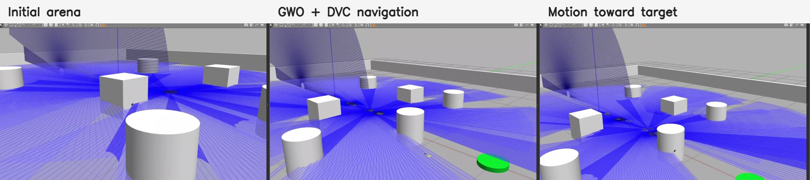
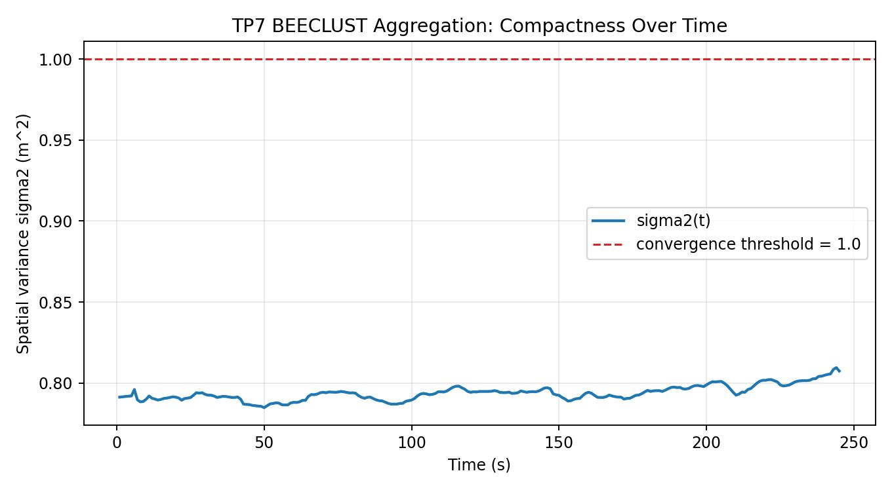
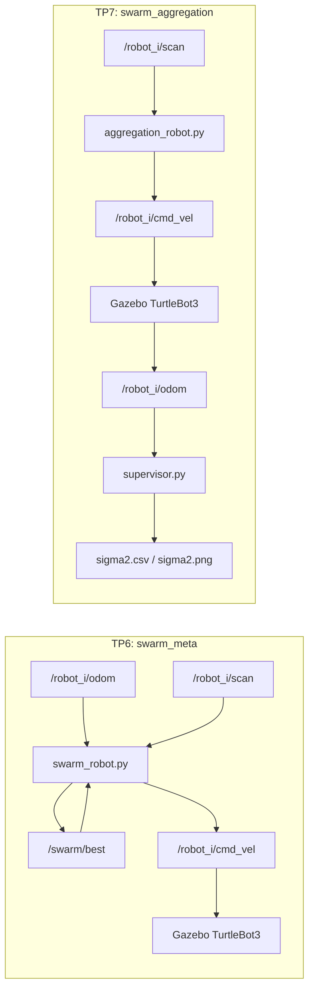

# Swarm Robotics TP6-TP7

ROS 2 Humble workspace for two swarm robotics labs using TurtleBot3 Burger robots in Gazebo.

- **TP6:** bio-inspired swarm control using Grey Wolf Optimization (GWO), dynamic velocity constraints (DVC), LiDAR obstacle avoidance, and adapted/original comparison support.
- **TP7:** decentralized BEECLUST-style aggregation with local LiDAR rules, bounded Gazebo arena, sigma2 convergence measurement, and tconv(N) analysis tools.

This repository is separate from the TP3-TP5 BCR Arm repository.

## Visual Summary

### TP6: GWO + DVC Navigation

The TP6 arena starts six TurtleBot3 robots on the left, places obstacles of increasing density in the middle, and uses a green target on the right. Each robot exchanges fitness through `/swarm/best`, selects alpha/beta/delta leaders, applies DVC from LiDAR distance, and publishes `/robot_i/cmd_vel`.



Recorded videos are kept outside git because they are large. The files were saved in the Windows screen recordings folder:

```text
TP6_GWO_DVC_run1.mp4
TP6_GWO_DVC_run2.mp4
TP6_GWO_DVC_run3.mp4
```

### TP7: BEECLUST Aggregation

The TP7 robots use only local LiDAR rules:

```text
MOVING -> neighbor/wall close -> STOPPED -> random TURNING -> MOVING
```

The supervisor is used only for measurement. It computes the spatial variance:

```text
x_bar(t) = (1 / N) sum_i x_i(t)
sigma2(t) = (1 / N) sum_i ||x_i(t) - x_bar(t)||^2
```



## Validated Results

| Lab | Scenario | Main Output | Current Result |
| --- | --- | --- | --- |
| TP6 | 6 TurtleBot3, GWO + DVC, obstacle arena | Gazebo videos + evaluator CSV support | Robots move toward the green target while avoiding obstacles |
| TP7 | 10 TurtleBot3, BEECLUST, bounded arena | `sigma2.csv`, `sigma2.png`, `tconv` | `tconv=1.00s`, mean `sigma2=0.7938`, duration `245.04s` |

TP7 saved run summary:

```text
rows=245
duration_s=245.04
first_sigma2=0.7913
last_sigma2=0.8074
min_sigma2=0.7848 at 50.01s
max_sigma2=0.8095 at 244.04s
mean_sigma2=0.7938
tconv=1.00s
```

## ROS 2 Architecture



## Repository Map

```text
swarm_ws/src/swarm_meta/
  launch/meta_swarm.launch.py       Gazebo + TP6 obstacle arena
  launch/controllers.launch.py      one GWO controller per robot namespace
  swarm_meta/swarm_robot.py         adapted GWO + DVC controller
  swarm_meta/evaluator.py           mean center fitness and survival logger
  swarm_meta/plot_metrics.py        TP6 comparison plotter
  worlds/meta_arena.world           target + obstacle arena

swarm_ws/src/swarm_aggregation/
  launch/swarm.launch.py            Gazebo + random robot spawn in bounded arena
  launch/aggregation.launch.py      one BEECLUST controller per namespace
  swarm_aggregation/aggregation_robot.py
  swarm_aggregation/supervisor.py
  swarm_aggregation/plot_sigma2.py
  swarm_aggregation/analyze_sigma2.py
  swarm_aggregation/plot_tconv.py
  worlds/aggregation_arena.world

docs/
  TP6_NOTES.md
  TP6_REPORT.md
  TP7_NOTES.md
  TP7_REPORT.md
  assets/
```

## Dependencies

```bash
sudo apt update
sudo apt install -y \
  ros-humble-turtlebot3* \
  ros-humble-turtlebot3-gazebo \
  ros-humble-gazebo-ros-pkgs

echo 'export TURTLEBOT3_MODEL=burger' >> ~/.bashrc
source ~/.bashrc

/usr/bin/python3 -m pip install --user numpy matplotlib pandas
```

## Build

```bash
cd /home/salmane/Tps/swarm_robotics/swarm_ws
source /opt/ros/humble/setup.bash
colcon build --cmake-args -DPython3_EXECUTABLE=/usr/bin/python3
source install/setup.bash
```

## Run TP6

Terminal 1:

```bash
cd /home/salmane/Tps/swarm_robotics/swarm_ws
source /opt/ros/humble/setup.bash
source install/setup.bash
export TURTLEBOT3_MODEL=burger
ros2 launch swarm_meta meta_swarm.launch.py n:=6
```

Terminal 2:

```bash
cd /home/salmane/Tps/swarm_robotics/swarm_ws
source /opt/ros/humble/setup.bash
source install/setup.bash
ros2 launch swarm_meta controllers.launch.py n:=6 algorithm:=gwo adapted:=true
```

Terminal 3, optional evaluator:

```bash
cd /home/salmane/Tps/swarm_robotics/swarm_ws
source /opt/ros/humble/setup.bash
source install/setup.bash
ros2 run swarm_meta evaluator --ros-args -p n:=6 -p output_csv:=tp6_adapted.csv
```

TP6 adapted/original comparison:

```bash
# Adapted GWO with signed acceleration and DVC
ros2 launch swarm_meta controllers.launch.py n:=6 algorithm:=gwo adapted:=true
ros2 run swarm_meta evaluator --ros-args -p n:=6 -p output_csv:=tp6_adapted.csv

# Original-style GWO without the signed acceleration bound
ros2 launch swarm_meta controllers.launch.py n:=6 algorithm:=gwo adapted:=false
ros2 run swarm_meta evaluator --ros-args -p n:=6 -p output_csv:=tp6_original.csv

ros2 run swarm_meta plot_metrics tp6_adapted.csv tp6_original.csv --labels adapted,original --output tp6_comparison.png
```

## Run TP7

Terminal 1:

```bash
cd /home/salmane/Tps/swarm_robotics/swarm_ws
source /opt/ros/humble/setup.bash
source install/setup.bash
export TURTLEBOT3_MODEL=burger
ros2 launch swarm_aggregation swarm.launch.py n:=10 arena:=1.2
```

Terminal 2:

```bash
cd /home/salmane/Tps/swarm_robotics/swarm_ws
source /opt/ros/humble/setup.bash
source install/setup.bash
ros2 launch swarm_aggregation aggregation.launch.py n:=10
```

Terminal 3:

```bash
cd /home/salmane/Tps/swarm_robotics/swarm_ws
source /opt/ros/humble/setup.bash
source install/setup.bash
rm -f sigma2.csv sigma2.png
ros2 service call /unpause_physics std_srvs/srv/Empty {}
ros2 run swarm_aggregation supervisor --ros-args -p n:=10 -p output_csv:=sigma2.csv
```

After the run:

```bash
ros2 run swarm_aggregation plot_sigma2
ros2 run swarm_aggregation analyze_sigma2 sigma2.csv
```

Parametric tconv(N) plot:

```bash
# Create a CSV with columns: N,run,tconv
ros2 run swarm_aggregation plot_tconv tconv_summary.csv --output tconv_by_n.png
```

## Debug Commands

```bash
ros2 topic list | grep robot_0
ros2 topic echo /robot_0/odom --once
ros2 topic echo /robot_0/scan --once
ros2 topic echo /robot_0/cmd_vel --once
ros2 topic echo /swarm/best --once
ros2 topic hz /robot_0/cmd_vel
```

## Deliverables

- TP6 ROS 2 package: `swarm_meta`
- TP6 report draft: `docs/TP6_REPORT.md`
- TP6 videos: recorded as `TP6_GWO_DVC_run*.mp4`
- TP7 ROS 2 package: `swarm_aggregation`
- TP7 report draft: `docs/TP7_REPORT.md`
- TP7 result plot: `docs/assets/tp7_sigma2_convergence.jpg`
- TP7 analysis tools: `plot_sigma2`, `analyze_sigma2`, `plot_tconv`
